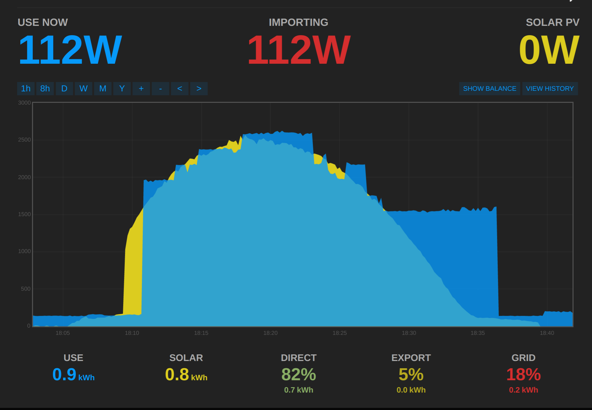
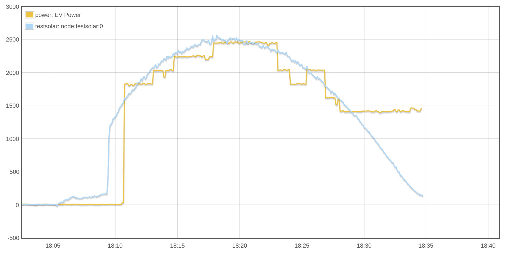
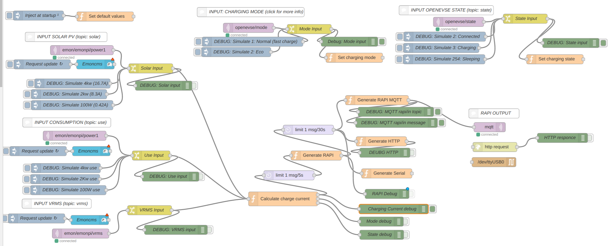

NodeRED flow for OpenEVSE EV charging station solar PV diversion

# Charging Modes

## 1: Normal Fast Charge (default)

- Charging at maximum rate irrispectic of solar PV output

## 2: Eco

- Charging level is moderated to match solar PV production
- If use (on-site consumption feed) is provided it will be subtracted (excess solar diversion)
- Charging will not start until available power > min charge rate (default 6A)
- Once charging has started charge rate will modulate down to min charge rate (default 6A)
- Charging will not pause once started since it was decided stoping / starting charging causes excess wear on the EVSE and the car

***

### NodeRED flow

*Pre-populated with emonPi and OpenEVSE default values.*

[See emonPi Solar PV monitoring application guide](https://https://guide.openenergymonitor.org/applications/solar-pv/)

NodeRED flow is very flexible, it can accept input and output from various sources:

**Using MQTT with [Wifi OpenEVSE V2.0 ESP8266 firmware](https://https://github.com/OpenEVSE/ESP8266_WiFi_v2.x) is highly recomended**

## Input

- **emonPi MQTT**
- **OpenEVSE MQTT (status)**

- Emoncms server e.g. https://emoncms.org

## Output

OpenEVSE RAPI options:

- **MQTT (emonESP WiFi 2.0)**
- Direct serial connection to OpenEVSE
- HTTP (emonESP WiFi 1.0 / 2.0)

***

There are positives and negatives to each input / output option:

## Data Acquisition

House consumption & solar PV gen real-time data

### Local MQTT via Emonpi

+ does not depend on any internet or local connection
+ Authenticated
+ Lowest latency
- Requires an emonPi on local network or MQTT port forwarding

### Via Emoncms.org API

+ Does not require emonPi
+ OpenEVSE can be on a different network / geographic location
- Depends on web connection and Emoncms.org connectivity
- Slightly higher latency

## Control signal

From RasPi to OpenEVSE

### Via direct serial

+ most reliable
+ does not require ESP wifi module
+ Not dependant on local Wifi network
+ Most secure
+ Easiest setup
- Requires emonPi or another RasPi running nodeRED within a in close proximity of OpenEVSE
- Not great for interoperability, no other device can send control signals
- Control can not easily be commanded remotely e.g. checking state and start / stop charging while out of the house
- Requires modification to openEVSE enclosure to allow serial cable out which could impact waterproofness

### Via MQTT

+ OpenEVSE can be in different location to emonPi
+ Does not require extra cable
+ Don't need to know OpenEVSE IP address
+ Better interoperability: devices / home automation platforms could also easily send and receive the control messages e.g. OpenHAB, HomeAssistant,
+ More secure than HTTP since MQTT is authenticated
+ Remote (from the web) control is possible, TSL MQTT
recommended
+ Slightly more setup since MQTT server details needs to be entered into openEVSE
- Requires MQTT server, emonPi has one built in
- Requires OpenEVSE ESP WiFi module with beta (dev) firmware
-
### Via HTTP (over local network)

+ OpenEVSE can be in different location to emonPi
+ Does not require extra cable
- Requires OpenEVSE ESP WiFi module with default (stable) firmware
- Requires knowledge of OpenEVSE IP address which can change since default is DHCP
- Depends on local network connectivity
- Not as secure as direct serial
+ / - Remote (from the web) control is possible but not recommended without authentication

